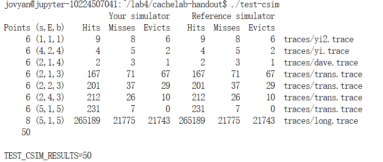

# CacheLab Report

## 实验目的
  本次实验要求通过C语言代码模拟实现Cache结构和其一些基本功能，当以valgrind内存跟踪作为输入时，可以模拟此跟踪上的缓存存储器的命中/不命中行为，并输出总命中数、失效数和驱逐数。

## 实验标准输入

根据handout文件中的说明，实验模拟器应接收一行参数和一个文件作为输入，例如：

### 1.命令行参数
对于cache模拟器，需要能处理一系列如下的命令：
```
        Usage: ./csim-ref [-hv] -s <s> -E <E> -b <b> -t <tracefile>
```

参考handout文件，其中各参数意义如下：

```
-h：输出帮助信息的选项；

-v：输出详细运行过程信息的选项；

-s：组索引的位数(意味着组数S=2^s)；

-E：每一组包含的行数；

-b：偏移位的宽度(意味着块的大小为B=2^b);

-t：输入数据文件的路径(测试数据从该文件里面读取)。
```
这些参数主要是对Cache的性能参数的定义，其中较重要的是s,E,b,t。s定义了Cache的组索引的位数，E定义了每一组的行数，b定义了偏移位的宽度(即块的大小)，t则给出了下一个文件参数的路径。
例如：
eg.'./csim-ref -v -s 4 -E 1 -b 4 -t traces/yi.trace'
Cache组索引有4位，每一组有1行，每行的块大小为2^4，下一个文件参数路径为traces/yi.trace。

### 2.文件参数
  Cache模拟器同时还接收一个文件作为参数，文件中包含需要模拟器模拟的Cache行为。根据handout说明，
  用于测试'csim.c'的输入文件，各个文件中包含了各种不同指令，用于测试'hits'、'missses'、'evictons'。

trace文件中的指令具有如下形式：

```
I 0400d7d4,8  //加载0400d7d4开始大小为8的指令

M 0421c7f0,4  //修改0421c7f0后大小为4的指令

L 04f6b868,8  //加载04f6b868后大小为8的指令

S 7ff0005c8,8 //储存7ff0005c8后大小为8的指令
```

即每行代表一个或两个内存访问。每行的格式是

[空格]操作 地址，大小

操作字段表示存储器访问的类型，其中：

`I`表示指令加载，

`L`表示数据加载，

`S`表示数据存储，

`M`表示数据修改（即数据存储之后的数据加载）。

每个`I`前面都没有空格。每个`M`，`L`和`S`之前总是有空格。

地址字段指定一个32位的十六进制存储器地址。

大小字段指定操作访问的字节数；

根据handout中的实验说明，可以得知：

1.`I`表示指令加载，对于`I`操作，实验说明中提到，我们不需要考虑：
也就是说valgrind文件运行地时候第一个指令总是为操作`I`，遇到时跳过即可。

2.`L`表示数据加载，`S`表示数据存储，对于`L`以及`S`操作，可以简单地认为这两个操作都是对某一个地址寄存器进行访问（读取或者存入数据）；

3.`M`表示数据修改即数据加载后跟数据存储，对于`M`操作，可以看作是对于同一地址连续进行`L`和`S`操作。

## 实验标准输出
  输出模拟Cache运行所给出的指令后的`hit_cnt`,`miss_cnt`,`eviction_cnt`。

##  相关数据结构
实现模拟Cache需要构建一个组相联的高速缓存，也就是说需要构建`Cache`，`Set`，`Line`三种结构。

### Line
首先实现最基本的`Line`结构。`Line`中储存有效位，标记位和高速缓存块三项内容，`Line`的大小为2^b。本次实验仅需模拟Cache行为，不需要储存数据
所以不需要在`Line`结构中设置高速缓存块。同时根据实验要求，由于要使用LRU替换策略，故还需要一个时间标记(LRU状态位)来记录上一次访问时间。
结构体如下：

```
typedef struct 
{
    int is_valid;//有效位
    int tag;//标记
    int time_flag;//为LRU实现准备，记录上一次访问这条缓存的时间
}cache_line,*cache_asso,**cache;
```

### Set
`Set`是`Line`的集合，用于构建组相连高速缓存中的组，每组有`E`行`Line`。

### Cache
模拟Cache需要使用`malloc`函数构建一个数组，命名为`Cache`，数组`Cache`大小为`s`，，数组`Cache`中每一个元素为一个`Set`结构。

由于后两个结构都是对`Line`的储存，我们可以选择使用`malloc`函数实现一个以`Line`为储存的基本元素的二维数组来模拟Cache，也就是说用`Cache[s][E]`来储存`Line`。
每一行表示一个`Set`。每一个基本单元格表示一个`Line`结构。这样我们就模拟出了Cache。为了方便起见，将对Cache的内容进行初始化。

```
//初始化cache
function init_cache():
    my_cache = (cache) malloc(sizeof(cache_asso) * S)
    for i in range(S):
        my_cache[i] = (cache_asso) malloc(sizeof(cache_line) * E)
        for j in range(E):
            my_cache[i][j].is_valid = 0
            my_cache[i][j].tag = -1
            my_cache[i][j].time_flag = -1

```


## 程序流程

### 1.数据读入（读入Cache基本参数和要模拟的指令）

根据handout的提示这里我们要用到`getopt`函数从解析命令行参数。该函数取三个参数：`argc`表示命令行参数的数量，`argv`是一个指向每个参数字符串的指针数组，
`optstring`表示要识别的选项。`hvs:E:b:t:`代表可带参数的选项"h"、"v"、"s"、"E"、"b"、"t"。
它们分别对应着`help`（帮助）、`verbose`（详细）、`set`（设置索引位数）、`associativity`（关联性）、`block`（块位数）和`tracefile`（跟踪文件）。 
并且前三个参数`h`,`v`,`s`可以为空，该函数返回下一个选项字符。
在CMU的handout中可以找到使用范例和相关说明：

**getopt	Example**
```
int main(int argc, char** argv)
{ 
 int opt,x,y; 
 /* looping over arguments */ 
 while(-1 != (opt = getopt(argc, argv, “x:y:")))
    { 
    /* determine which argument it’s processing */ 
    switch(opt) 
      { 
        case 'x': 
            x = atoi(optarg); 
            break; 
        case ‘y': 
            y = atoi(optarg); 
            break; 
        default: 
            printf(“wrong argument\n"); 
            break; 
      } 
    } 
} 
```
**"Suppose the program executable	was	called	“foo”.	
Then	we	would	call	“./foo	-x	1	–y	3“	to	pass	the	value	1	
to	variable	x	and	3	to	y."**

于是我们可以改写输入函数，伪代码如下：

```
while (-1 != (opt = getopt(argc, argv, "hvs:E:b:t:"))):
    switch(opt):
        case 's':
            s = atoi(optarg)
            break
        case 'E':
            E = atoi(optarg)
            break
        case 'b':
            b = atoi(optarg)
            break
        case 't':
            strcpy(t, optarg)
            break
        default:
            break
```

此时`s`,`E`,`b`,`t`已经完成输入(不考虑hvs的情况下)，Cache的基本参数已经设置完毕。
注意这时t中储存了文件参数的路径，所以我们还需要采用只读方式打开目标文件，用`FILE* fp=fopen(t,"r");`进一步获取需要模拟的指令输入。
同时使用`fscanf`函数读取文件中的每一行的三个要素即指令类型，目标地址，和操作对象偏移量。接下来只需要每读入一条指令的同时，
根据指令类型对Cache行为进行模拟，需要的话对地址和`hit_cnt`,`miss_cnt`,`eviction_cnt`进行更新即可。
附上伪代码：

```
function read_input():
    fp = fopen(t, "r")
    if fp == NULL:
        print("open error")
        exit(-1)

    while read line from file fp:
        read (operation, address, size) from line
        switch operation:
            case 'L':
                update(address)
                break
            case 'M':
                update(address)
                // miss的话还要进行一次storage
            case 'S':
                update(address)

        update_time_flag() // 更新时间戳

    fclose(fp)

    for i in range(S):
        free(my_cache[i])
    free(my_cache) // malloc完要记得free并且关文件

```

## 2.数据处理（对读入的需要模拟指令进行模拟）

这里需要构建`update`函数对模拟Cache进行更新，为了更新Cache，首先需要将传入的`address`进行解码，传入的`address`可以分为标记位，组索引和偏移位。
这里根据已知的`s`（组索引位数）和`b`（块偏移位数）使用位运算提取出组索引和标记位备用。使用`for`循环遍历`Cache`中的第`Set_index`行，模拟在对应的`Set`中寻找有没有需要的数据。

### 1.若命中

遇到某一个元素模拟的`Line`的`tag`相同并且`valid_bit`为1，则命中，
说明找到了需要的数据则进行`hit_cnt++`，将LRU使用的`time_flag`置为0，表示最近刚刚使用过。

### 2.若不命中
需分两种情况讨论
#### a）若有空行，则将从下一级储存中取出数据后直接填入空行

  这里需要在模拟将数据填入空行后将该`Line`的有效位置为1，将`tag`更新为新数据的`tag`，将LRU使用的`time_flag`置为0，表示最近刚刚使用过。
  
#### b）若没有空行，就说明要从下一层缓存中取出后再根据LRU驱逐某一行

  首先对`eviction_cnt`和`miss_cnt`进行自增运算,然后遍历当前Set找到`time_flag`最大的`Line`，驱逐这个`Line`并将数据填入，
  修改其对应的`tag`，并将LRU使用的`time_flag`置为0，表示最近刚刚使用过。

伪代码如下：

```
function update(address):
    set_index = (address >> b) & ((0xffffffff) >> (64 - s))
    input_tag = address >> (b + s)
    
    max_flag = INT_MIN
    max_flag_index = -1
    
    // tag相同并且valid_bit为1，则命中               
    for i in range(E):
        if my_cache[set_index][i].tag == input_tag and my_cache[set_index][i].is_valid == 1:
            my_cache[set_index][i].time_flag = 0
            hit_cnt++
            return
        
    // 若不命中
    // 若有空行，则将从下一级储存中取出数据后直接填入空行
    for i in range(E):
        if my_cache[set_index][i].is_valid == 0:
            my_cache[set_index][i].is_valid = 1
            my_cache[set_index][i].tag = input_tag
            my_cache[set_index][i].time_flag = 0
            miss_cnt++
            return
        
    // 没有命中也没有空行就说明要从下一层缓存中取出后再根据LRU驱逐某一行
    eviction_cnt++
    miss_cnt++
                   
    for i in range(E):
        if my_cache[set_index][i].time_flag > max_flag:
            max_flag = my_cache[set_index][i].time_flag
            max_flag_index = i
    my_cache[set_index][max_flag_index].tag = input_tag
    my_cache[set_index][max_flag_index].time_flag = 0
    return

// 更新LRU标记
function update_time_flag():
    for i in range(S):
        for j in range(E):
            if my_cache[i][j].is_valid == 1:
                my_cache[i][j].time_flag++
```

**注意：每完成一次指令数据的处理要更新一次`time_flag`**
  每完成一次指令处理对`time_flag`进行一次更新，从而保证最近使用的`Line`的`time_flag`最大，这样就可以保证LRU替换策略的可行性。
  
## 3.函数描述和调用关系

### 1.函数描述

本次模拟使用的函数有
  
`void init_cache()` //构造Cache结构并完成对Cache的初始化
  
`void update(unsigned int address)` //根据输入的`address`模拟Cache的行为，计算`hit_cnt`,`miss_cnt`,`eviction_cnt`
  
`void update_time_flag()` //更新`time_flag`，保证LRU算法的可行性
  
`void read_input()` //从输入文件中读入要模拟的指令
  
`int main(int argc ,char* argv[])` //主函数，从命令行读取Cache基本参数，并对其他函数进行调用

### 2.调用关系

主函数`int main(int argc ,char* argv[])`先调用`void init_cache()`完成Cache结构初始化再调用`s`完成数据读入。

`void read_input()`先调用`void update(unsigned int address)` 模拟Cache的行为，计算`hit_cnt`,`miss_cnt`,`eviction_cnt`,
再调用`void update_time_flag()` 更新`time_flag`，保证LRU算法的可行性。

## 4.实验总结

  本次实验模拟了Cache的行为，个人认为主要难点在于如何正确的读入输入的数据以及指令文件中的指令，在这一过程中学习并实践使用了`getopt`以及`fscanf`两个函数，
  了解了如何从文件中读取输入。同时为了模拟Cache的行为使用C语言构建了Cache的基本结构，添加了`time_flag`用来实现LRU替换策略，
  对全相联高速缓存中`Cache`，`Set`，`Line`的关系有了进一步理解，可以通过`malloc`和二维数组储存数据结构的方式模拟Cache的行为，熟悉了`malloc`函数的用法。
  在构建流程图的过程中，更进一步了解了Cache的工作流程，梳理了各个函数之间的关系。
  
运行结果：


  
  
  
  
  
